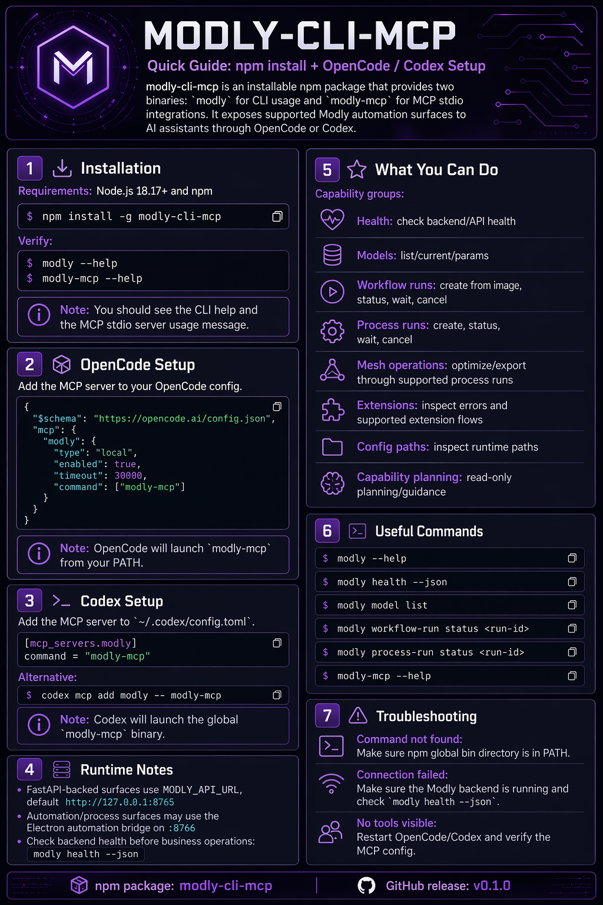

# Modly CLI + MCP

External headless tooling for **Modly**.

This repository keeps the operational automation layer **outside** the upstream Modly desktop app so CLI, MCP, OpenCode/Codex integration, and packaging concerns do not pollute the product repository.

## Quick Start



## What this package provides

- **`modly`** — installable headless CLI
- **`modly-mcp`** — installable MCP server over stdio

The root npm package is **bin-only**. Package-root imports are not supported, and deep imports such as `src/*` are not supported public entrypoints.

## Current capabilities

### CLI groups in the public contract

- `capabilities`
- `health`
- `model`
- `generate`
- `job`
- `process-run`
- `workflow-run`
- `mesh`
- `ext`
- `ext-dev`
- `config`

`ext` is the runtime-oriented extension surface.
`ext-dev` is the V1 plan-only extension development surface.

## Operational reality of extension installs

Real-world testing against external extensions made these boundaries explicit:

- `modly ext stage github` is **preflight only**. It fetches and inspects a candidate stage, but it does **not** install the extension and does **not** leave it operational by itself.
- `modly ext apply` is the real install seam against a live target. It applies a **prepared** stage into the real extensions directory and may trigger live-target setup when the staged contract requires it.
- If that live-target setup fails after files were applied, `ext apply` can legitimately end in `applied_degraded`. That means the install seam worked, but setup did not finish cleanly.
- `modly ext repair` is reapply over an already prepared stage. It may also trigger live-target setup, now accepts the same relevant setup flags as `apply`, and defaults to **no backup** when the extension already exists.
- `modly ext setup` executes an explicit, limited setup contract. It is **not** a universal install manager. Some extensions require explicit inputs such as `gpu_sm`.
- If a third-party `setup.py` ignores `PIP_*` variables or performs its own downloads, CLI resilience can be partial or absent. The seam can improve observation and diagnostics, but it cannot force a broken setup script to behave.
- `modly ext setup-status` is only a live-target observer. `--wait` and `--follow` are local observation modes, `--timeout-ms` only stops the observer, and there is no general cancel/reattach/job-manager layer here.
- In practice the CLI/MCP already separates seam failures from extension failures reasonably well, but third-party extensions can still fail for their own reasons: `setup.py`, missing wheels, ABI mismatches, or Linux ARM64 constraints.
- Do **not** promise universal compatibility. Some heavy stacks on Linux ARM64 need CPU fallbacks or extension-side patches; the CLI can help observe and diagnose, but it cannot invent a missing wheel.

## `ext-dev` planning contract (V1)

`modly ext-dev` analyzes a **local** extension workspace and emits planning evidence only. It does **not** install, build, release, or repair, and it does not mutate runtime state.

### Command purpose

- `bucket-detect` — classify the workspace into one planning bucket and emit mandatory metadata
- `preflight` — validate workspace boundaries and optionally attach FastAPI readiness evidence
- `scaffold` — emit a non-executing implementation plan
- `audit` — report risks, gaps, and optional bridge confirmation/collision evidence
- `release-plan` — emit an ordered release checklist without publishing anything

### Scope and heuristics

- V1 supports `manifest.json` only
- `model-simple` when the manifest has no `setup` or `process` object
- `model-managed-setup` when the manifest declares `setup`
- `process-extension` when the manifest declares `process`

### Mandatory metadata in every plan

- `resolution`
- `implementation_profile`
- `setup_contract`
- `support_state`
- `surface_owner`
- `headless_eligible`
- `linux_arm64_risk`

### Boundary limits

- FastAPI-backed evidence stays limited to readiness/business-operation boundaries
- Electron owns setup, workflow, install/repair, and live extension operations
- planned identity stays separate from live identity confirmation
- V1 stays plan-only even when optional FastAPI or bridge checks are available

### Default public MCP catalog

- `modly.capabilities.get`
- `modly.capability.plan`
- `modly.capability.guide`
- `modly.diagnostic.guidance`
- `modly.capability.execute`
- `modly.health`
- `modly.model.list`
- `modly.model.current`
- `modly.model.params`
- `modly.ext.errors`
- `modly.config.paths.get`
- `modly.job.status`
- `modly.workflowRun.createFromImage`
- `modly.workflowRun.status`
- `modly.workflowRun.cancel`
- `modly.workflowRun.wait`
- `modly.processRun.create`
- `modly.processRun.status`
- `modly.processRun.wait`
- `modly.processRun.cancel`

### Read-only surfaces

- backend health
- model listing / current model / model params
- extension errors
- runtime paths
- job status
- capabilities discovery (`modly capabilities`, `modly.capabilities.get`)
- read-only capability planning (`modly.capability.plan`)

### Executable surfaces

- `workflow-run from-image`
- `workflow-run status`
- `workflow-run cancel`
- `workflow-run wait`
- `process-run create`
- `process-run status`
- `process-run cancel`
- `process-run wait`
- MCP tools:
  - `modly.workflowRun.createFromImage`
  - `modly.workflowRun.status`
  - `modly.workflowRun.cancel`
  - `modly.workflowRun.wait`
  - `modly.processRun.create`
  - `modly.processRun.status`
  - `modly.processRun.cancel`
  - `modly.processRun.wait`
  - `modly.capability.execute`

### Execution surface taxonomy

- `workflow-run` / `process-run` and `modly.workflowRun.*` / `modly.processRun.*` are the **canonical run primitive** surfaces.
- `modly.capability.execute` is an **orchestration wrapper** over those canonical run primitives; recovery and polling stay anchored on `workflow-run` / `process-run` status surfaces.
- `modly.recipe.execute` is an experimental **orchestration wrapper** over the same run primitives; it remains opt-in and never replaces canonical recovery.
- `generate` / `job` and `modly.job.status` remain **legacy compatibility** surfaces.

## Explicitly out of scope

This repository does **not** pretend to support:

- workflow management (`workflow_id`, list/save/import/export)
- Electron IPC automation
- real **Add to Scene** execution
- generic DAG workflow orchestration
- automatic wait during `workflow-run from-image`
- automatic multi-step chaining inside `modly.capability.execute`

`workflow-run wait` / `modly.workflowRun.wait` only wait on an already-created `workflow run` via the existing status surface. They do **not** imply workflow management, **Add to Scene**, or blocking `from-image` behavior.

`modly.capability.execute` is intentionally transparent and conservative. In the current cut it can execute:

- image → mesh via `workflowRun.createFromImage`
- mesh → mesh via `processRun.create` for `mesh-optimizer/optimize`
- mesh → export via `processRun.create` for `mesh-exporter/export` ONLY when the backend chooses the default output location

It does **not** execute unknown capabilities, UI-only nodes, `UniRig`, generic process chains, or explicit exporter output-path requests. `input.outputPath` and `params.output_path` remain outside this MVP and are rejected locally.

For direct `processRun.create` calls targeting `mesh-optimizer/optimize` or `mesh-exporter/export`, `workspace_path` is normalized to the mesh file itself. If the client receives only the parent directory but `params.mesh_path` identifies the local mesh file unambiguously, it autocorrects to the full file path before dispatch.

`scene_candidate` is treated as **descriptive output only**, not as a scene mutation.

`modly.recipe.execute` is the guided orchestration layer for the MVP, and it remains EXPERIMENTAL and default-off.
It is hidden by default and disabled unless you opt in with `MODLY_EXPERIMENTAL_RECIPE_EXECUTE`.

When the flag is not set, `modly.recipe.execute` is absent from the advertised MCP catalog and direct invocation stays disabled.
Only enable it deliberately for experimental recipe testing.

When enabled, the tool remains intentionally constrained:

- recipes v1 only: `image_to_mesh`, `image_to_mesh_optimized`, `image_to_mesh_exported`
- polling-first only: the first call may start work, then clients MUST continue with `options.resume`
- `maxNewRunsPerCall=1`: every invocation creates at most one new workflow/process run
- exporter support stays gated to `default_output_only`
- no free-form goals, no branching, no automatic retries, and no hidden waits

The public contract is an observable envelope with `recipe`, `status`, `steps`, `runIds`, `outputs`, `limits`, and `nextAction`, so agents can see partial progress and resume explicitly instead of relying on blind blocking behavior.

## Repository structure

```text
.
├── docs/
│   ├── install/
│   └── specs/
├── skills/
│   └── modly-operator/
│   └── modly-extension-planner/
├── src/
│   ├── cli/
│   ├── core/
│   └── mcp/
├── templates/
│   ├── codex/
│   └── opencode/
└── test/
    ├── cli/
    ├── core/
    ├── mcp/
    └── packaging/
```

## Development commands

These commands are for **developing this source repository**, not for consumer-project integration.

```bash
node src/cli/index.mjs --help
node src/mcp/server.mjs --help
npm run test
npm run coverage
npm run lint
npm run type-check
```

## Reusable AI skills in this repo

- `skills/modly-operator/SKILL.md` — headless/runtime Modly operating guidance
- `skills/modly-extension-planner/SKILL.md` — `ext-dev` planning guidance for local `manifest.json` workspaces

## Installable usage

The installable contract of this package exposes two real binaries:

- `modly`
- `modly-mcp`

Runtime note:

- FastAPI-backed surfaces use `MODLY_API_URL` (default `http://127.0.0.1:8765`)
- capabilities and process-runs use the Electron automation bridge on `:8766`
- by default the client derives those bridge URLs from `MODLY_API_URL`
- you may override them explicitly with `MODLY_AUTOMATION_URL` and `MODLY_PROCESS_URL`

Consumer repositories should use those installed binaries directly, or the documented repo-local wrapper.

They should **not** point OpenCode or Codex at the source checkout of this repository as a supported integration model.
They should also **not** rely on package-root imports or deep imports from this package.

## Supported installable modes

There are exactly two supported installable modes:

1. global installed binary
2. repo-local wrapper

Those installable modes are supported for these clients:

- OpenCode
- Codex

Pointing OpenCode or Codex at the source checkout of this repository is unsupported.

## OpenCode integration

### Global installed binary

Canonical shape:

```json
{
  "$schema": "https://opencode.ai/config.json",
  "mcp": {
    "modly": {
      "type": "local",
      "enabled": true,
      "timeout": 30000,
      "command": ["modly-mcp"]
    }
  }
}
```

### Repo-local wrapper

Canonical shape:

```json
{
  "$schema": "https://opencode.ai/config.json",
  "mcp": {
    "modly": {
      "type": "local",
      "enabled": true,
      "timeout": 30000,
      "command": [
        "node",
        "tools/modly_mcp/run_server.mjs"
      ]
    }
  },
  "skills": {
    "paths": ["node_modules/modly-cli-mcp/skills"]
  }
}
```

In the supported OpenCode repo-local flow, the installed package now makes the packaged skills available automatically through `skills.paths` pointing at `node_modules/modly-cli-mcp/skills`.

The global OpenCode flow keeps the supported `modly-mcp` binary contract, but it does **not** provide that same automatic repo-local skills discovery contract.

## Codex integration

Codex uses MCP configuration in `~/.codex/config.toml` for global defaults and `.codex/config.toml` for repository-scoped overrides in trusted projects.

### Global installed binary

Canonical shape:

```toml
[mcp_servers.modly]
command = "modly-mcp"
```

### Repo-local wrapper

Canonical shape:

```toml
[mcp_servers.modly]
command = "node"
args = ["tools/modly_mcp/run_server.mjs"]
```

Repo-local Codex configuration lives in `.codex/config.toml` and is loaded only in a trusted project.

### Global installation

See:

- [`docs/install/global.md`](docs/install/global.md)

### OpenCode repo-local installation

See:

- [`docs/install/repo-local.md`](docs/install/repo-local.md)
- [`templates/opencode/opencode.json`](templates/opencode/opencode.json)
- [`templates/opencode/repo-local.opencode.json`](templates/opencode/repo-local.opencode.json)
- [`templates/opencode/run_server.mjs`](templates/opencode/run_server.mjs)

### Codex installation

See:

- [`docs/install/codex-global.md`](docs/install/codex-global.md)
- [`docs/install/codex-repo-local.md`](docs/install/codex-repo-local.md)
- [`templates/codex/global.config.toml`](templates/codex/global.config.toml)
- [`templates/codex/repo-local.config.toml`](templates/codex/repo-local.config.toml)

`tools/modly_mcp/run_server.mjs` is the supported repo-local wrapper path for OpenCode and Codex consumer repositories.

## Wait capability boundaries

- `workflow-run wait <run-id>` waits for `done`, `error`, or `cancelled` on an existing run.
- `modly.workflowRun.wait({ runId, intervalMs?, timeoutMs? })` exposes the same capability over MCP.
- Both surfaces rely on the existing workflow-run status endpoint plus the required `GET /health` readiness check before business operations.
- This does **not** add workflow CRUD/management, real scene mutation, or `--wait` support to `workflow-run from-image`.
- `workflow-run` / `process-run` are the primary run surfaces.
- `workflow-run` / `process-run` remain the canonical run primitive recovery path for long-running execution.
- `generate` / `job` remain observable compatibility surfaces.

## Recommended long-running pattern

- For agents, prefer `create -> status -> status -> ...` instead of blocking on `wait`.
- MCP long-running tools keep `data.run` intact and add recovery hints in `data.meta` only.
- `modly.workflowRun.{createFromImage,status,wait}` and `modly.processRun.{create,status,wait}` expose `data.meta.operation`, `data.meta.operationState`, `data.meta.nextAction`, and non-terminal `data.meta.suggestedPollIntervalMs`.
- `workflow-run status` / `modly.workflowRun.status` expose `data.meta.terminal` so polling clients can stop without mutating `data.run`.
- `workflow-run wait` / `modly.workflowRun.wait` remain available as a bounded convenience wrapper over status polling; use short timeout windows when you cannot drive polling yourself.
- `data.meta.nextAction` always points back to the canonical status tool with the same `runId`; recovery MUST resume polling an existing run, not recreate it.
- Wait timeouts include bounded polling diagnostics in `error.details` (`timeoutMs`, `intervalMs`, `elapsedMs`, `attempts`, `lastObservedRun`).

## Guided recipe MVP (`modly.recipe.execute`)

- `modly.recipe.execute` is experimental, opt-in, and hidden by default.
- Enable it only with `MODLY_EXPERIMENTAL_RECIPE_EXECUTE`.
- Without that flag, the tool stays disabled and is not advertised in the public MCP catalog.
- `modly.recipe.execute` runs one allowlisted recipe over the existing capability/workflow/process surfaces; it is NOT a generic workflow engine.
- Supported recipes v1 are exactly `image_to_mesh`, `image_to_mesh_optimized`, and `image_to_mesh_exported`.
- `image_to_mesh_exported` stays within the exporter `default_output_only` slice. Custom `input.export.outputPath` and `input.export.params.output_path` are out of scope and rejected.
- The execution model is polling-first: a call can either poll the active run or launch the next step, but the client keeps control by sending `options.resume` on the next invocation.
- The runtime guarantee is `maxNewRunsPerCall=1`, which means each invocation can create AT MOST one new run after observing current state.
- Out of scope by contract: free-form goals, branching, DAGs, automatic retries, hidden waits, workflow CRUD, and invented headless support for Electron-only actions.

Minimal contract example:

```json
{
  "recipe": "image_to_mesh_optimized",
  "status": "running",
  "steps": [
    {
      "id": "generate_mesh",
      "status": "running",
      "run": {
        "kind": "workflowRun",
        "runId": "recipe-workflow-123",
        "status": "queued"
      },
      "poll": {
        "tool": "modly.workflowRun.status",
        "input": { "runId": "recipe-workflow-123" },
        "intervalMs": 1000
      }
    }
  ],
  "runIds": {
    "generate_mesh": "recipe-workflow-123"
  },
  "outputs": {},
  "limits": {
    "maxNewRunsPerCall": 1
  },
  "nextAction": {
    "kind": "poll"
  }
}
```

## Architectural notes

- `src/core/modly-api.mjs` is the single HTTP source of truth for CLI and MCP.
- `src/core/modly-normalizers.mjs` keeps payload shapes stable across layers.
- `src/core/smart-capability-registry.mjs` and `src/core/smart-capability-planner.mjs` hold the read-only capability planner used by `modly.capability.plan` and `modly.capability.execute`.
- `src/mcp/*` stays intentionally small and reuses the same core logic instead of shelling out to the CLI.
- The CLI groups are named **`workflow-run`** and **`process-run`** on purpose, to avoid implying full workflow management.

## Status

This repository is now beyond a read-only MCP.

It already supports a practical execution path for:

`image -> workflow run create -> status -> status -> ...`

against the backend `workflow-runs` surface implemented in Modly.

`wait` is still supported for compatibility, but the preferred automation shape is polling-first with explicit `status` checks.
